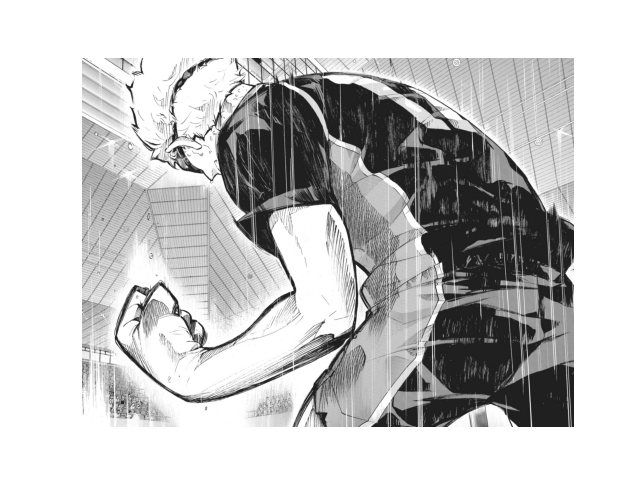
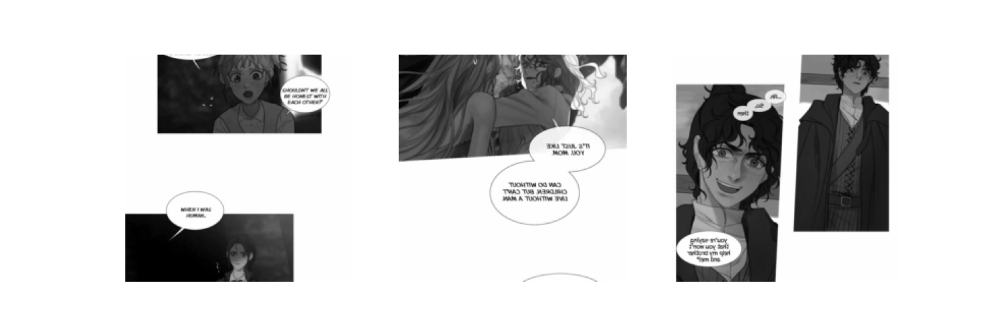
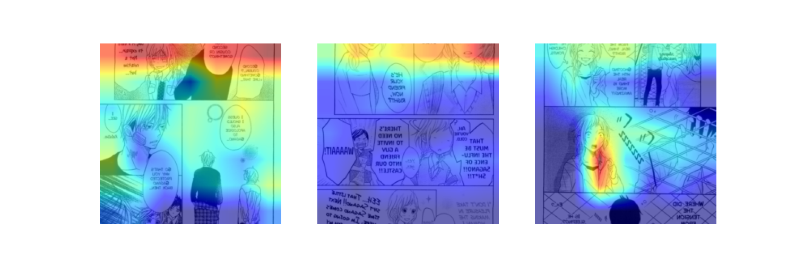

***
</img>
<h2 style="font-family:Copperplate, Papyrus, fantasy;
           font-size:30px;
           font-style:bold;
           color:white;" align=center>
    Regressive Approach in Rating Mangas thru Sample Art</h2>

by : JP Fabrero

***

    <h2 style="font-family:Copperplate, Papyrus, fantasy;
               font-size:30px;
               margin: 15px;
               font-style:bold;
               color:white;">
        Overview
    </h2>

I'm taking out all the literary elements of a manga and look closer at the key visual elements that make a manga shine. Using only samples of manga's panels or pages, I'm building a model that learns all the relevant art style, character design, etc. By analyzing these factors, my model, ManGanda, aims and attempts to provide a sneak peek of a manga's potential rating.

By undertaking this project, I seek to help both publishers and readers make better-informed decisions about which manga series to invest in and promote.

Started from building my own dataset by Web Scraping. 

    <b>Sample Panel - Haikyuu!! by Furudate Haruichi.
    </b>

  

Building custom Datasets and Dataloaders using Pytorch. Finally, proceeded to retraining a Pretrained ResNET model and coming up with ManGanda. It's best predictive performance so far is off only by  ±0.31 on average. Although the performance of the model seem satisfactory, it still have some room for improvement. 

    <b>Sample Prediction - The Pale Horse.
     Average Model Prediction - 7.70
     Actual Rating - 7.63</b>

  

Ultimately, ManGanda further leveraged XAI in cracking down the key visual elements with hope to guide artists of what works or don't.

    <b>GradCAM Implementation - P to JK.</b>

  

You can find the full story in my <a href='https://github.com/jpK1ba/ManGanda/blob/master/ManGanda.ipynb'>notebook</a>. 
